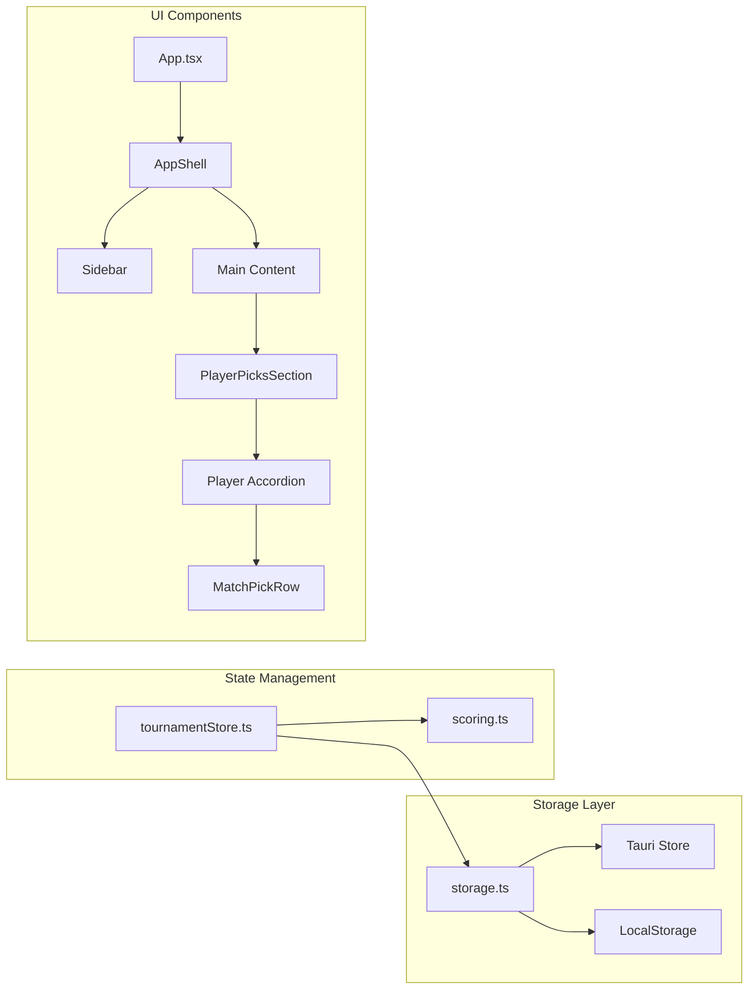

# Requirements

### Overview & Goals
Implement RFC-002 to address critical issues discovered after the first iteration. The goal is to make the application usable by fixing persistence, updating to the correct 2026 World Cup format (48 teams), and implementing the core match picks functionality.

### Scope
- **In Scope**:
    - **Persistence**: Environment-aware storage (Tauri + LocalStorage fallback).
    - **Data Models**: Dynamic phases with `isKnockout` flag instead of hardcoded types.
    - **Layout**: Sidebar-based navigation for better desktop experience.
    - **Features**: Player-specific match picks using accordions and inline rows.
    - **Templates**: 2026 World Cup (48 teams) as the default format.
- **Out of Scope**:
    - Bracket view propagation (deferred to RFC-003).
    - JSON import/export.
    - Automated "best 3rd place" advancement logic (stays manual per RFC).

# Technical Design

### Current Implementation
- **Persistence**: Uses `@tauri-apps/plugin-store` directly, which fails in non-Tauri environments (dev/web).
- **Phases**: Hardcoded `type` enum prevents flexible tournament structures.
- **Navigation**: Horizontal tab bar that lacks scalability.
- **Picks**: Only "Champion" and "Top Scorer" can be picked; match picks are missing from UI.

### Key Decisions
1. **Lazy Storage Initialisation**: Storage is initialised on first use to avoid race conditions with the Tauri runtime.
2. **Side-by-Side Persistence**: Fallback to `localStorage` ensures the app remains testable in browsers without a full Tauri build.
3. **Dynamic Phase Logic**: Replacing `type` with `isKnockout` allows the scoring engine to handle custom tournament formats natively.
4. **Template-Agnostic Core**: Move template definitions out of types and into data files to allow for easy expansion.

### Architecture Diagram

### Proposed Changes
- **Store**: Extract persistence to `src/store/storage.ts`.
- **Types**: Update `TournamentPhase` to include `isKnockout`, `allowDraw`, `label`, and `order`.
- **Layout**: New `AppShell` and `Sidebar` components.
- **Picks**: `MatchPickRow` for inline score entry; `PlayerPicksSection` for grouped player views.
- **Data**: `templates.ts` and `countries.ts` for tournament configuration.

### File Structure
- `src/store/storage.ts` (New)
- `src/components/layout/Sidebar.tsx` (New)
- `src/components/layout/AppShell.tsx` (New)
- `src/features/picks/PlayerPicksSection.tsx` (New)
- `src/features/picks/MatchPickRow.tsx` (New)
- `src/data/templates.ts` (New)
- `src/data/countries.ts` (New)
- `src/store/tournamentStore.ts` (Modified)
- `src/types/index.ts` (Modified)
- `src/App.tsx` (Modified)

# Testing

### Validation Approach
Verification will be performed through manual UI testing and by ensuring persistence works across reloads.

### Key Scenarios
- **Persistence**: Verify that adding a player or a pick survives a page refresh (testing both `localStorage` and Tauri if possible).
- **Template Creation**: Create a `t48` tournament and verify that 12 groups and the Round of 32 are correctly generated.
- **Match Picks**: Open a player's accordion, enter a score, save it, and verify the points are updated in the store.
- **Knockout Logic**: Verify that the "Knockout Winner" selector only appears for knockout matches when the score is tied.
- **Navigation**: Verify that clicking sidebar items switches content correctly and highlights the active state.

# Delivery Steps

### * Step 1: Implement Persistence Fix and Dynamic Data Models
The application has a robust, environment-aware storage system and updated data models to support dynamic tournament phases.

- Create `src/store/storage.ts` with a `tauriStorage` adapter and `localStorage` fallback.
- Update `src/store/tournamentStore.ts` to use the new `appStorage`.
- Update `src/types/index.ts` to refactor `TournamentPhase` (replacing `type` with `isKnockout`, `allowDraw`, etc.).
- Update scoring logic in `tournamentStore.ts` to use `phase.isKnockout`.
- Add new i18n keys to `src/i18n/locales/pl.json` for navigation and templates.
- Commit the changes for this step.

###   Step 2: Implement Sidebar Layout and AppShell Navigation
The application uses a modern sidebar layout for navigation on desktop and a responsive layout for smaller screens.

- Create `src/components/layout/Sidebar.tsx` with navigation items and active state management.
- Create `src/components/layout/AppShell.tsx` as a layout wrapper for the sidebar and main content.
- Refactor `src/App.tsx` to replace the horizontal tab bar with the new `AppShell` and `Sidebar` components.
- Update `App.tsx` state to handle the new navigation IDs from the RFC.
- Commit the changes for this step.

###   Step 3: Implement Match Picks with Player Accordions
Users can view and enter match picks for each player through an organized accordion-based interface.

- Create `src/features/picks/MatchPickRow.tsx` for compact, inline match pick entry.
- Implement knockout winner selection in `MatchPickRow` only when `phase.isKnockout` is true and goals are tied.
- Create `src/features/picks/PlayerPicksSection.tsx` to display player accordions containing both tournament and match picks.
- Replace the current player/pick list in `App.tsx` with `PlayerPicksSection`.
- Commit the changes for this step.

###   Step 4: Implement 48-Team Templates and Real Tournament Creator
The tournament creator supports the 2026 World Cup format (48 teams) and other templates using real data.

- Create `src/data/templates.ts` with `t48` (default), `t32`, `t16`, and `league` definitions.
- Create `src/data/countries.ts` with the 48 qualified nations for the 2026 tournament.
- Implement `applyTemplate` logic to generate the correct phase and group structure.
- Update `TournamentCreator.tsx` to use the new templates and replace demo data with a real country picker.
- Commit the changes for this step.