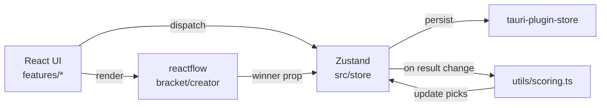

# Requirements

### Overview & Goals
Libero is a desktop betting pool application for the Football World Cup, built for Libero Law Firm's internal use. It replaces manual spreadsheets with automatic point calculation, visual React Flow brackets, and editable picks/results. The first version delivers a working end-to-end flow for tournament setup, player management, match results, picks, scoring, standings, and bracket visualization, following all specs in `docs/rfcs/rfc-001.md`, UI mocks in `docs/layout/libero-mocks.html`, styles in `docs/layout/styles.css`, and BDD scenarios in `docs/bdds/001-bdd.md`.

### Scope
**In Scope (v1):**
- Project bootstrap with exact Tauri 2 + React 18 + TS 5 + Tailwind + React Flow + Zustand + i18next stack (fixed versions, no ^/~)
- Data models, scoring logic, and Zustand store with Tauri persistence
- Tournament creation from templates (WC 32, WC 16, League, Custom) with React Flow creator for groups/phases
- Player CRUD and tournament-level champion/top-scorer picks
- Match result entry (group + knockout with extra time/penalties) and automatic scoring
- Standings table with ex aequo and special categories
- Knockout bracket view with winner propagation in React Flow
- JSON import/export
- Full Polish UI via i18next (English keys in code)
- ESLint/Prettier/Vitest/Playwright setup
- E2E tests mapped to key BDD scenarios from `001-bdd.md`

**Out of Scope (v1):**
- Auto-update / GitHub releases
- Custom phase editing beyond basic
- Advanced drag-and-drop overrides in bracket
- Multiple languages beyond Polish
- Any network features

### User Stories
- As the app owner, I want to create a tournament from a template and visually arrange groups/bracket so that the structure matches the World Cup format.
- As the owner, I want to add players and let them register always-editable picks (match + tournament) so that no manual spreadsheet is needed.
- As the owner, I want to enter/edit match results at any time and see points recalculate automatically so that the standings stay accurate.
- As the owner, I want to view a live React Flow bracket and standings table so that progression and rankings are clear.

### Functional Requirements
- Scoring exactly as in RFC §8: 3 pts exact, 1 pt correct sign (group), +1 knockout bonus on draw pick + correct winner.
- All picks and results always editable (no locks).
- React Flow used for creator canvas and bracket (nodes: Team, Group, Match, PhaseHeader).
- Persistence via `tauri-plugin-store`.
- All user-facing text via `t('key')` from `src/i18n/locales/pl.json` (keys match RFC examples).
- Design follows tokens and components from `styles.css` (light/dark, panels, player-cards, win-bar, etc.) translated to Tailwind + custom CSS where needed.

### Non-Functional Requirements
- Runs as single-user local Tauri desktop app on macOS/Windows/Linux.
- Points recalculate instantly on any result change.
- Testable via data-testid attributes specified in BDD scenarios.

# Technical Design

### Current Implementation
Project contains only documentation (`README.md`, `docs/rfcs/rfc-001.md`, `docs/bdds/001-bdd.md`, `docs/layout/libero-mocks.html`, `docs/layout/styles.css`). No source code or `package.json` yet.

### Key Decisions
- Follow RFC-001 exactly: fixed package versions (e.g. `react@18.3.1`, `reactflow@11.11.4`, `zustand@4.5.4`, `i18next@23.11.5`), directory structure with `src/features/{tournament,players,matches,picks,standings,bracket,import-export}/`, English-only code, Polish-only UI.
- Use React Flow for both tournament creator and live bracket (node types: TeamNodeData, GroupNodeData, MatchNodeData, PhaseHeaderNodeData).
- Zustand for global state with middleware for persistence via Tauri store plugin.
- Scoring logic extracted to pure functions in `src/utils/scoring.ts` (calculateGroupPhasePick, calculateKnockoutPhasePick) called from store on result updates.
- UI components mirror mock HTML structure (win-bar, panel, player-card, etc.) using Tailwind + design tokens adapted from `styles.css`.
- All changes trigger full re-calculation of affected MatchPick points (per RFC 8.3).

### Proposed Changes
- Bootstrap Tauri 2 app with React template, then pin exact versions and add missing packages.
- Implement types from RFC §7 in `src/types/index.ts`.
- Build i18n setup (`src/i18n/index.ts` + `pl.json` with keys from RFC 5.2).
- Create Zustand store slices for tournament, players, matches, picks.
- Port visual patterns from `libero-mocks.html` into React components (e.g. PlayerCard, MatchResultForm, StandingsTable).
- Wire React Flow in `features/bracket` and `features/tournament` for creator + result-driven winner propagation.
- Add winner propagation logic (RFC 6.4) that clears downstream results on edit.

### Data Models / Contracts
Key interfaces (from RFC §7):
```ts
interface Country { id: string; name: string; flag: string; }
interface Player { id: string; name: string; createdAt: string; }
interface Match { id: string; phaseId: string; groupLabel?: string; homeTeam: string; awayTeam: string; result?: MatchResult; ... }
interface MatchResult { homeGoals: number; awayGoals: number; extraTime?: {...}; penalties?: {winner: string}; }
interface MatchPick { id: string; playerId: string; matchId: string; homeGoals: number; awayGoals: number; knockoutWinner?: string; ... }
interface TournamentPick { playerId: string; champion: string; topScorer: string; ... }
interface Tournament { id: string; name: string; templateId: string; countries: string[]; groups: Record<string,string[]>; phases: TournamentPhase[]; ... }
```
Scoring contracts exactly as in RFC §8.1–8.2.

### Components
- `src/App.tsx` — main layout with tabs (Gracze, Typowania, Mecze, Drabinka, Tabela)
- `features/tournament/TournamentCreator.tsx` — React Flow canvas + template selector
- `features/players/PlayerList.tsx` + `PlayerForm.tsx` — cards matching mock HTML
- `features/matches/MatchResultForm.tsx` — result inputs + extra time/penalties
- `features/picks/PickForm.tsx` — per-player match picks + knockout winner select
- `features/standings/StandingsTable.tsx` — rank, ex aequo, special categories
- `features/bracket/BracketView.tsx` — React Flow knockout graph
- Shared: `components/WinBar.tsx`, `components/Panel.tsx`, icon sprite from mocks

### File Structure
Matches RFC §4.2 exactly:
```
src/
├── components/
├── features/
│   ├── tournament/
│   ├── players/
│   ├── matches/
│   ├── picks/
│   ├── standings/
│   ├── bracket/
│   └── import-export/
├── store/
├── types/
├── utils/
├── i18n/
│   ├── index.ts
│   └── locales/pl.json
└── App.tsx
src-tauri/...
tests/{unit,e2e}/
```

### Architecture Diagram


### Risks
- React Flow node/edge management and manual position persistence can be complex; mitigate by starting with auto-layout then optional drag.
- Winner propagation on result edit may clear many downstream matches — confirm with user dialog (per RFC 6.4).
- Exact package pinning may cause install issues on some OS; document lockfile.
- BDD scenarios reference specific data-testid — ensure components expose them from day one.

# Testing

### Validation Approach
All BDD scenarios from `docs/bdds/001-bdd.md` will drive E2E tests (Playwright). Unit tests (Vitest) will cover pure scoring logic and store actions. Every interactive element uses the exact `data-testid` values mentioned in the Gherkin scenarios for reliable selectors.

### Key Scenarios
- Tournament creation from template, validation errors (name/countries)
- Player add/edit/delete with duplicate check
- Match result entry (group + knockout with penalties) triggers point recalc
- Knockout bonus (+1) awarded only on correct draw pick + winner
- Standings sort + ex aequo badge
- Bracket winner propagation clears downstream results
- Import/export round-trips data

### Edge Cases
- Editing an earlier round result that changes later opponents
- Ex aequo players (same points/rank)
- Tournament with no results yet (0 pts for all)
- Deleting phase that has results (warning dialog)
- Custom tournament with manual phases

### Test Changes
- `tests/unit/scoring.test.ts` — Vitest tests for both calculate* functions with table-driven cases
- `tests/e2e/tournament-creation.spec.ts`, `players.spec.ts`, `results-and-standings.spec.ts` — Playwright tests directly implementing the Gherkin scenarios from `001-bdd.md`
- All tests use English descriptions (per RFC rule) even though UI is Polish
- CI-friendly: `npm test` and `npm run test:e2e` scripts

# Delivery Steps

### ✓ Step 1: initialize-tauri-react-project
Tauri + React + TypeScript + Tailwind + React Flow project is bootstrapped with every package pinned to the exact versions listed in RFC-001 §4.1.

- Run `tauri create` (or equivalent) to produce `src-tauri/` and `src/` skeleton matching RFC directory layout.
- Edit `package.json` to pin exact versions: react@18.3.1, react-dom@18.3.1, typescript@5.4.5, tailwindcss@3.4.4, reactflow@11.11.4, zustand@4.5.4, i18next@23.11.5, react-i18next@14.1.2, @tauri-apps/api@2.0.0, tauri-plugin-store@2.0.0, lucide-react@0.395.0, vitest@1.6.0, @playwright/test@1.45.0, eslint@8.57.0, prettier@3.3.2 and all plugins.
- Configure `tsconfig.json`, `vite.config.ts`, `.eslintrc.cjs`, `.prettierrc` exactly as in RFC §9.
- Add Tailwind and React Flow dependencies and initial CSS imports.
- Create placeholder `src/App.tsx` and `src-tauri/tauri.conf.json` with Polish window title.

### * Step 2: implement-core-infrastructure
Types, i18n, scoring utilities, and Zustand store with persistence are implemented and testable.

- Create `src/types/index.ts` containing all interfaces from RFC §7 (Country, Player, Match, MatchResult, MatchPick, TournamentPick, Tournament, TournamentPhase, TournamentTemplate) plus BUILT_IN_TEMPLATES constant.
- Implement `src/utils/scoring.ts` with `calculateGroupPhasePick` and `calculateKnockoutPhasePick` functions exactly as in RFC §8.1–8.2.
- Set up `src/i18n/index.ts` (i18next init) and `src/i18n/locales/pl.json` with all keys shown in RFC §5.2 plus additional keys needed for v1 screens.
- Create `src/store/tournamentStore.ts` (and related slices) using Zustand + tauri-plugin-store persistence; include actions for createTournament, addPlayer, updateMatchResult, submitPick, recalculatePoints.
- Add helper `src/utils/winnerPropagation.ts` skeleton for bracket logic (RFC 6.4).

###   Step 3: build-tournament-players-and-picks
Tournament creation (template + React Flow groups/phases), player management, and tournament/match picks are fully functional with Polish UI.

- Implement `src/features/tournament/` components: TemplateSelector, TournamentForm, TournamentCreator (React Flow canvas for groups and phase headers) matching mock HTML layout.
- Implement `src/features/players/`: PlayerList (grid of player-cards), PlayerForm modal, stats display.
- Implement `src/features/picks/`: MatchPickForm and TournamentPickForm (champion + topScorer) with always-editable behavior.
- Wire forms to store; all labels use `useTranslation()` keys.
- Add basic tab navigation in App.tsx matching the mock screens (Gracze i typowania, etc.).
- Ensure design tokens and component styles from `styles.css` are replicated via Tailwind + small custom CSS module.

###   Step 4: implement-matches-standings-bracket-and-tests
Match results, automatic scoring + winner propagation, standings table, React Flow bracket view, JSON import/export, and initial BDD-driven tests are complete.

- Build `src/features/matches/`: MatchList + MatchResultForm (home/away goals + extraTime + penalties winner select).
- Build `src/features/standings/`: StandingsTable with rank, ex aequo badge, special categories section, matching mock HTML.
- Build `src/features/bracket/`: BracketView using React Flow with MatchNodeData, winner propagation on result change, clearing downstream stale results with confirmation.
- Implement `src/features/import-export/` JSON round-trip.
- Add data-testid attributes required by BDD scenarios (e.g. error-tournament-name, dialog-delete-phase-warning).
- Create `tests/unit/scoring.test.ts` (Vitest) covering scoring table cases.
- Create `tests/e2e/` Playwright specs that implement the main Gherkin scenarios from `docs/bdds/001-bdd.md` (tournament creation, players, results & standings).
- Verify `npm run test` and `npm run test:e2e` pass for v1 flows.
