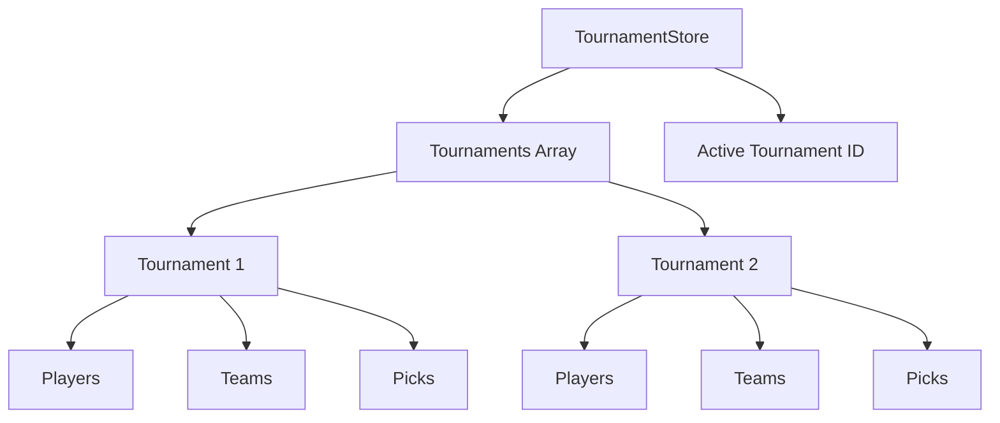

# Requirements

### Overview & Goals
Refactor the application to support multiple independent tournaments instead of a single global tournament. Each tournament will have its own set of players, teams, match results, and picks. The user will be able to switch between tournaments and create new ones via the sidebar.

### Scope
- **In Scope**:
    - Multi-tournament support in the data model and store.
    - Tournament switcher in the sidebar.
    - "Create Tournament" functionality accessible from the sidebar.
    - Scoping players, teams, and picks to specific tournaments.
    - Renaming specific tournament names (Euro, World Cup) to generic "Tournament" labels.
- **Out of Scope**:
    - User authentication (still local-only).
    - Sharing players/teams across tournaments (each tournament is isolated).

### Functional Requirements
- **Tournament Selection**: Users can see a list of all created tournaments in the sidebar and switch between them.
- **Tournament Creation**: A dedicated button in the sidebar allows creating a new tournament at any time.
- **Isolated Data**: Players, teams, and picks added to one tournament do not appear in others.
- **Modifiable Teams**: Users can modify the list of teams and their details within a tournament.
- **Generic Branding**: The UI uses generic "Tournament" terms instead of "World Cup 2026" or "Euro".

# Technical Design

### Current Implementation
The application currently supports a single `tournament` in the global state. Players and picks are managed at the top level of the state, meaning they are shared (or overwritten) if a new tournament is created.

### Key Decisions
- **State Structure**: The `AppState` will be transformed from a single-tournament focus to a multi-tournament collection.
- **Tournament-Scoped Entities**: `players`, `matchPicks`, and `tournamentPicks` will be moved inside the `Tournament` interface to ensure strict isolation.
- **Active State**: The UI will reactively update based on an `activeTournamentId`.

### Architecture Diagram


### Proposed Changes

#### Data Models (`src/types/index.ts`)
- Update `Tournament` interface:
  ```typescript
  export interface Tournament {
    id: string;
    name: string;
    templateId: string;
    teams: Country[]; // full objects to allow modification
    groups: Record<string, string[]>;
    phases: TournamentPhase[];
    players: Player[];
    matchPicks: Record<string, MatchPick[]>;
    tournamentPicks: Record<string, TournamentPick>;
    createdAt: string;
  }
  ```
- Update `AppState` interface:
  ```typescript
  export interface AppState {
    tournaments: Tournament[];
    activeTournamentId: string | null;
  }
  ```

#### Store Logic (`src/store/tournamentStore.ts`)
- Refactor all actions to find the active tournament in the `tournaments` array before applying changes.
- Add `setActiveTournament(id: string)` action.
- Update `createTournament` to push to the array instead of replacing the state.

#### UI Components
- **Sidebar (`src/components/layout/Sidebar.tsx`)**:
  - Add a scrollable list of tournaments.
  - Add a "Plus" button for "New Tournament".
- **Team Management**: Add a UI section to edit `teams` within the active tournament.

### File Structure
- `src/features/tournament/TeamManager.tsx`: New component for editing tournament teams.
- All files in `src/features/` will be updated to consume the active tournament's data.

# Testing

### Validation Approach
- Verify that creating a new tournament does not delete the previous one.
- Verify that switching tournaments in the sidebar updates all views (players, matches, bracket).
- Verify that adding a player to "Tournament A" does not show that player in "Tournament B".
- Verify that "Euro" and "World Cup" strings are no longer present in the UI.

### Key Scenarios
1.  **Creation Flow**: User clicks "+" in sidebar -> selects template -> enters name -> tournament appears in list and becomes active.
2.  **Switching Flow**: User has 2 tournaments -> clicks the second one -> Match List updates to show the second tournament's matches.
3.  **Data Isolation**: User adds "John" to Tournament A -> switches to Tournament B -> Player list is empty (as expected).

# Delivery Steps

### ✓ Step 1: Refactor data models and store for multi-tournament support
Update data models and the store to support multiple tournaments.
- Update `Tournament` interface in `src/types/index.ts` to include `players`, `matchPicks`, `tournamentPicks`, and replace `countries: string[]` with `teams: Country[]`.
- Update `AppState` in `src/types/index.ts` to hold an array of `tournaments` and an `activeTournamentId`.
- Refactor `src/store/tournamentStore.ts` to manage the collection of tournaments and ensure all actions (add player, update match result, etc.) target the active tournament.
- Implement `setActiveTournament` and update `createTournament` to support multiple instances.

### ✓ Step 2: Implement Tournament selection in Sidebar
Add tournament selection and creation to the sidebar.
- Modify `src/components/layout/Sidebar.tsx` to include a "Tournaments" section listing all available tournaments.
- Add a "Create Tournament" button at the bottom of the tournament list.
- Connect the list and button to the `TournamentStore`.
- Ensure the sidebar highlights the active tournament.

### ✓ Step 3: Implement Team and User management per tournament
Allow users to manage teams and players within each tournament.
- Create a new component (or update existing ones) to allow adding, editing, and removing teams in the active tournament.
- Ensure `PlayerList` and `PlayerForm` correctly scope their operations to the active tournament.
- Update `TournamentCreator` to allow creating new tournaments even if one already exists.

### ✓ Step 4: Generalize UI labels and translations
Remove all specific references to Euro or World Cup and replace them with generic "Tournament" labels.
- Update `src/i18n/locales/pl.json` to use "Turniej" instead of "MŚ" or "Euro".
- Rename template names in `src/data/templates.ts` to be tournament-agnostic (e.g., "Format 32 teams").
- Update the app title and tags in the UI.